# 🔍 Crypto Campaign Donation App - Technical Assessment Report

## Executive Summary

**Date:** August 21, 2025  
**Project:** Crypto Campaign Donation System  
**Current Status:** Fragmented across multiple platforms with integration gaps  
**Recommendation:** Consolidate to Claude Code with strategic subagent orchestration

---

## 📊 Current State Analysis

### Component Architecture

#### 1. **Smart Contract Layer** (`/contracts/`)

- **Status:** ✅ Complete and Well-Architected
- **Location:** `/contracts/src/CampaignContributions.sol`
- **Features:**
  - FEC compliance ($3,300 limits)
  - KYC verification system
  - Multi-sig treasury management
  - Comprehensive audit logging
  - Emergency pause mechanism
- **Deployment:** Not yet deployed (missing deployment scripts)

#### 2. **Frontend Application** (`/frontend/`)

- **Status:** ⚠️ Partially Complete
- **Components Found:**
  - SetupWizard (campaign configuration)
  - Campaign info forms
  - Form customization
  - Embed options
  - Compliance checks
  - Bank connection setup
- **Missing:** Direct donor contribution interface

#### 3. **Backend Infrastructure**

- **Status:** ❌ Fragmented
- **Database:** Supabase configured but tables not fully created
- **API:** No unified API layer
- **Sync Tools:** Replit sync project exists separately

#### 4. **Testing Framework**

- **Status:** ⚠️ Basic Structure Only
- **Tools:** Playwright configured
- **Tests:** Visual and E2E test files exist but incomplete
- **Coverage:** No smart contract tests

---

## 🔴 Critical Integration Gaps

### 1. **Missing Components**

- ❌ Donor contribution UI connected to smart contract
- ❌ Web3 wallet integration (MetaMask, WalletConnect)
- ❌ Smart contract deployment pipeline
- ❌ API bridge between frontend and blockchain
- ❌ Real-time transaction monitoring
- ❌ KYC verification interface
- ❌ Admin dashboard for campaign management

### 2. **Data Flow Disconnects**

```mermaid
graph LR
    A[Landing Page] -->|❌| B[Campaign Setup]
    B -->|⚠️| C[Database]
    B -->|❌| D[Smart Contract]
    E[Donor Form] -->|❌| D
    D -->|❌| F[Transaction Confirmation]
    C -->|❌| G[Analytics Dashboard]
```



### 3. **Platform Fragmentation Issues**

- **Claude Code:** Frontend development
- **Lovable:** UI/UX design (unclear current state)
- **Replit:** Smart contract development
- **Local:** Sync management
- **Result:** No single source of truth

---

## ✅ Platform Consolidation Strategy

### Recommendation: **Full Migration to Claude Code**

#### Rationale:

1. **Unified Development Environment:** All code in one place
2. **Superior Tooling:** Full IDE capabilities with Web3 support
3. **Integrated Testing:** Run all tests from one location
4. **Simplified Deployment:** Single CI/CD pipeline
5. **Better Collaboration:** Reduced context switching

### Migration Plan

#### Phase 1: Consolidation (Week 1)

```bash
# 1. Create unified project structure
/crypto-campaign-unified/
├── contracts/          # Smart contracts
├── frontend/           # React application
├── backend/            # API layer
├── tests/              # All test suites
├── scripts/            # Deployment & automation
└── docs/               # Documentation
```

#### Phase 2: Integration Development (Week 2)

- Build Web3 integration layer
- Create donor contribution flow
- Implement KYC verification UI
- Connect all components

#### Phase 3: Testing & Deployment (Week 3)

- Complete test coverage
- Deploy to testnet
- User acceptance testing
- Production deployment

---

## 🏗️ Complete Integration Roadmap

### Priority 1: Core Infrastructure (Days 1-3)

- [ ] Set up unified repository structure
- [ ] Configure Hardhat for contract deployment
- [ ] Implement Web3 provider (ethers.js)
- [ ] Create API bridge service
- [ ] Set up environment configurations

### Priority 2: Donor Flow Implementation (Days 4-7)

- [ ] Build donation form component
- [ ] Integrate MetaMask/WalletConnect
- [ ] Connect to smart contract
- [ ] Implement transaction monitoring
- [ ] Create confirmation screens

### Priority 3: Admin & Management (Days 8-10)

- [ ] Build admin dashboard
- [ ] KYC verification interface
- [ ] Campaign analytics
- [ ] Treasury management tools
- [ ] Compliance reporting

### Priority 4: Testing & Security (Days 11-14)

- [ ] Smart contract unit tests
- [ ] Integration test suite
- [ ] E2E user journey tests
- [ ] Security audit
- [ ] Performance optimization

---

## 🧪 Comprehensive Testing Strategy

### 1. **Smart Contract Testing**

```javascript
// Using Hardhat & Chai
- Unit tests for all functions
- Edge case testing
- Gas optimization tests
- Security vulnerability tests
- Compliance verification tests
```

### 2. **Integration Testing**

```javascript
// Using Jest & Testing Library
- Web3 provider mocking
- Transaction flow testing
- Error handling scenarios
- State management tests
```

### 3. **E2E Testing**

```javascript
// Using Playwright
- Complete donation journey
- Campaign setup flow
- Admin operations
- Cross-browser testing
- Mobile responsiveness
```

### 4. **Web3-Specific Testing**

- Testnet deployment (Sepolia/Goerli)
- Multiple wallet testing
- Network switching scenarios
- Gas estimation accuracy
- Transaction failure handling

### Testing Environment Setup

```yaml
networks:
  local:
    - Hardhat Network
    - Local Supabase
  testnet:
    - Sepolia/Base Testnet
    - Staging Supabase
  mainnet:
    - Ethereum/Base Mainnet
    - Production Supabase
```

---

## 🤖 Subagent Management Strategy

### Recommended Agent Allocation

#### Terminal 1: Smart Contract Agent

```bash
npx claude-flow sparc run architect "Smart contract deployment pipeline"
```

**Responsibilities:**

- Contract compilation
- Deployment scripts
- Verification tasks
- Gas optimization

#### Terminal 2: Frontend Integration Agent

```bash
npx claude-flow sparc run coder "Web3 frontend integration"
```

**Responsibilities:**

- Wallet connections
- Transaction UI
- State management
- Error handling

#### Terminal 3: Testing Orchestrator

```bash
npx claude-flow sparc run tester "Comprehensive test suite"
```

**Responsibilities:**

- Test execution
- Coverage reports
- Performance metrics
- Security scanning

#### Terminal 4: DevOps Agent

```bash
npx claude-flow sparc run cicd-engineer "CI/CD pipeline setup"
```

**Responsibilities:**

- Build automation
- Deployment pipeline
- Environment management
- Monitoring setup

### Coordination Protocol


---

## 📈 Implementation Timeline

### Week 1: Foundation

- Day 1-2: Repository consolidation
- Day 3-4: Core infrastructure setup
- Day 5-7: Basic integration implementation

### Week 2: Feature Development

- Day 8-10: Donor flow completion
- Day 11-12: Admin tools
- Day 13-14: Testing implementation

### Week 3: Production Readiness

- Day 15-17: Security audit & fixes
- Day 18-19: Performance optimization
- Day 20-21: Deployment & launch

---

## 🚀 Immediate Next Steps

### 1. **Repository Consolidation** (Today)

```bash
# Create unified structure
mkdir -p crypto-campaign-unified/{contracts,frontend,backend,tests,scripts,docs}

# Move existing code
cp -r Desktop/crypto-campaign-setup/* crypto-campaign-unified/

# Initialize proper git repository
cd crypto-campaign-unified && git init
```

### 2. **Install Web3 Dependencies**

```bash
npm install ethers hardhat @nomiclabs/hardhat-ethers
npm install --save-dev @types/mocha chai
```

### 3. **Create Integration Layer**

```javascript
// backend/services/web3Service.js
import { ethers } from 'ethers';
import CampaignABI from '../contracts/CampaignContributions.json';

class Web3Service {
  constructor() {
    this.provider = new ethers.providers.Web3Provider(window.ethereum);
    this.contract = new ethers.Contract(CONTRACT_ADDRESS, CampaignABI, this.provider);
  }
  // ... implementation
}
```

### 4. **Set Up Testing Framework**

```bash
# Initialize Hardhat
npx hardhat init

# Configure test networks
# Update hardhat.config.js with test networks
```

---

## 💡 Key Recommendations

### Immediate Actions:

1. **Consolidate all code to Claude Code** - Stop platform fragmentation
2. **Build the missing donor interface** - Critical path component
3. **Deploy smart contract to testnet** - Enable real testing
4. **Implement Web3 integration** - Connect frontend to blockchain
5. **Create comprehensive test suite** - Ensure reliability

### Architecture Improvements:

1. **Use event-driven architecture** for real-time updates
2. **Implement proper state management** (Redux/Zustand)
3. **Add transaction queue system** for reliability
4. **Create fallback mechanisms** for Web3 failures
5. **Implement proper logging and monitoring**

### Security Considerations:

1. **Smart contract audit** before mainnet deployment
2. **Implement rate limiting** on API endpoints
3. **Add fraud detection** for suspicious patterns
4. **Use secure key management** (never expose private keys)
5. **Implement proper CORS policies**

---

## 📋 Success Metrics

### Technical KPIs:

- ✅ 100% test coverage for smart contracts
- ✅ <2 second transaction confirmation UI updates
- ✅ 99.9% uptime for donation processing
- ✅ Zero security vulnerabilities in audit
- ✅ <500ms API response times

### User Experience KPIs:

- ✅ <3 clicks to complete donation
- ✅ <30 seconds for KYC verification
- ✅ Mobile-responsive on all devices
- ✅ Support for 5+ wallet types
- ✅ Real-time transaction status updates

---

## 🎯 Conclusion

The crypto campaign donation app has solid foundational components but suffers from platform fragmentation and missing integration layers. By consolidating to Claude Code and following this integration roadmap, you can deliver a production-ready system within 3 weeks.

**Critical Success Factors:**

1. Immediate consolidation to single platform
2. Focus on donor flow as priority
3. Comprehensive testing before launch
4. Strategic use of subagents for parallel work
5. Clear coordination between components

**Next Action:** Begin repository consolidation and Web3 integration layer implementation immediately.

---

_Report Generated: August 21, 2025_  
_Status: Ready for Implementation_  
_Estimated Timeline: 3 weeks to production_
