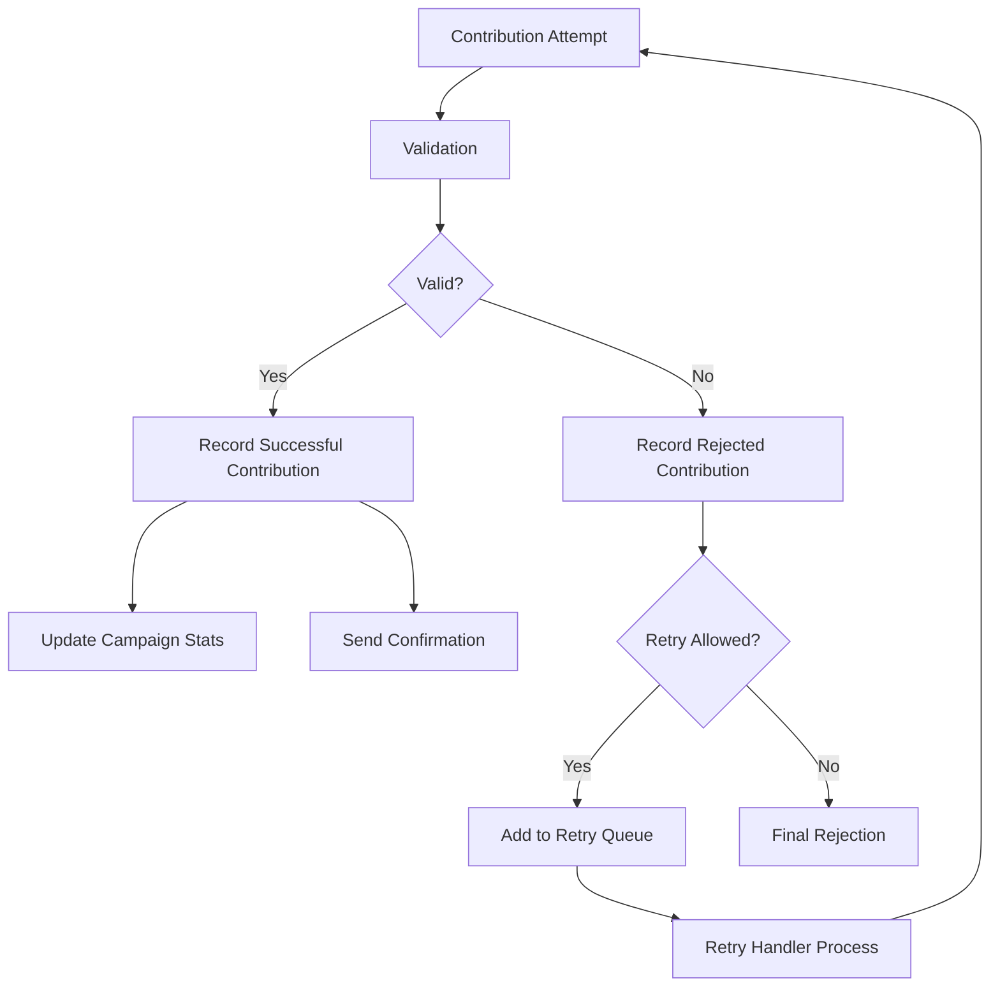

# Contribution Recording System Documentation

## Overview

The Contribution Recording System is a comprehensive solution for tracking both successful and rejected cryptocurrency campaign contributions. It ensures FEC compliance, provides robust error handling, automatic retry mechanisms, and real-time monitoring with alerting capabilities.

## Architecture

### Core Components

1. **ContributionRecorderService** - Main service for recording contributions
2. **BlockchainEventHandler** - Listens to blockchain events and triggers recording
3. **RetryHandler** - Manages automatic retries for failed contributions
4. **ContributionMonitor** - Real-time monitoring and alerting system
5. **API Endpoints** - REST APIs for querying contribution status

### Database Schema

#### Tables

1. **contributions** - Stores successful contributions
2. **rejected_contributions** - Stores failed/rejected contribution attempts
3. **monitoring_alerts** - Stores system alerts
4. **monitoring_reports** - Stores periodic monitoring reports
5. **contribution_analytics** - View for analytics data

## Contribution Flow

### 1. Contribution Attempt



### 2. Validation Process

The system validates contributions through multiple checks:

1. **Wallet Address Validation**
   - Format validation (valid Ethereum address)
   - Blacklist check
   - Risk assessment

2. **KYC Verification**
   - On-chain KYC status check
   - Database KYC record verification
   - Compliance requirements

3. **Amount Validation**
   - Minimum amount ($1)
   - Maximum per-transaction limit ($3,300 FEC limit)
   - Cumulative contribution limit check

4. **Campaign Validation**
   - Campaign exists and is active
   - Campaign hasn't ended
   - Campaign accepts contributions

5. **Transaction Validation**
   - No duplicate transactions
   - Valid transaction hash format
   - Blockchain confirmation

6. **Risk Assessment**
   - Wallet age analysis
   - Contribution frequency check
   - Amount pattern detection
   - VPN/Proxy detection

## Rejection Reasons

### Categories

| Reason Code                  | Description                      | Retry Allowed |
| ---------------------------- | -------------------------------- | ------------- |
| `KYC_NOT_VERIFIED`           | KYC verification required        | Yes           |
| `EXCEEDS_CONTRIBUTION_LIMIT` | Exceeds cumulative FEC limit     | Yes           |
| `EXCEEDS_TRANSACTION_LIMIT`  | Single transaction exceeds limit | Yes           |
| `INVALID_WALLET_ADDRESS`     | Invalid Ethereum address format  | Yes           |
| `INSUFFICIENT_FUNDS`         | Wallet has insufficient balance  | Yes           |
| `TRANSACTION_FAILED`         | Blockchain transaction failed    | Yes           |
| `SMART_CONTRACT_ERROR`       | Smart contract execution error   | Yes           |
| `NETWORK_ERROR`              | Network connectivity issue       | Yes           |
| `DUPLICATE_TRANSACTION`      | Transaction already processed    | No            |
| `BLACKLISTED_ADDRESS`        | Wallet address is blacklisted    | No            |
| `SUSPICIOUS_ACTIVITY`        | High risk score detected         | Yes           |
| `COMPLIANCE_VIOLATION`       | FEC compliance violation         | No            |
| `INVALID_AMOUNT`             | Amount below minimum or invalid  | Yes           |
| `CAMPAIGN_INACTIVE`          | Campaign is paused or inactive   | Yes           |
| `CAMPAIGN_ENDED`             | Campaign has ended               | No            |
| `SYSTEM_ERROR`               | Internal system error            | Yes           |
| `OTHER`                      | Other unspecified reason         | Yes           |

## Blockchain Event Handling

### Event Listeners

1. **ContributionAccepted** - Successful on-chain contribution
2. **ContributionRejected** - On-chain rejection
3. **KYCStatusUpdated** - KYC verification status change

### Event Processing Flow

```javascript
// Example blockchain event processing
contract.on('ContributionAccepted', async (contributor, amountWei, amountUsd, txHash, event) => {
  // 1. Prevent duplicate processing
  // 2. Get transaction details
  // 3. Get contributor details
  // 4. Record contribution
  // 5. Monitor confirmations
});
```

### Transaction Monitoring

- Monitors pending transactions for failures
- Checks for stuck transactions (gas price too low)
- Verifies transaction confirmation count
- Handles blockchain reorganizations

## Retry Logic

### Retry Strategy

1. **Exponential Backoff**
   - 1st retry: 1 minute
   - 2nd retry: 5 minutes
   - 3rd retry: 15 minutes
   - 4th retry: 1 hour
   - 5th retry: 6 hours

2. **Retry Conditions**
   - Checks if rejection reason has been resolved
   - Validates current conditions (KYC, campaign status, etc.)
   - Prevents retries for permanent rejections

3. **Max Retries**
   - Maximum 5 retry attempts
   - After max retries, added to manual review queue

### Retry Handler Operations

```javascript
// Retry handler runs every minute
setInterval(() => {
  // 1. Get eligible retries
  // 2. Check retry conditions
  // 3. Attempt contribution recording
  // 4. Update retry status
  // 5. Clean up expired retries
}, 60000);
```

## Monitoring & Alerts

### Monitored Metrics

1. **Rejection Rate** - Alert if >30% rejections
2. **High Risk Contributions** - Alert for risk score >75
3. **Rapid Contributions** - Alert for >10 contributions/hour
4. **Large Amounts** - Alert for contributions >$2,500
5. **Failed Retries** - Alert after 3 failed retry attempts
6. **Stuck Transactions** - Alert for >5 stuck transactions
7. **System Health** - Database, blockchain, API connectivity
8. **Compliance Violations** - FEC limit violations

### Alert Priorities

| Priority | Response Time | Notification Method     |
| -------- | ------------- | ----------------------- |
| Critical | Immediate     | Email, Webhook, Console |
| High     | < 5 minutes   | Email, Console          |
| Normal   | < 30 minutes  | Console                 |

### Real-time Monitoring

```javascript
// Real-time high-risk detection
supabase.channel('high-risk-rejections').on(
  'postgres_changes',
  {
    event: 'INSERT',
    table: 'rejected_contributions',
    filter: 'risk_score=gte.75',
  },
  handleHighRisk
);
```

## API Endpoints

### Contribution Status Queries

#### Get Contribution Status

```http
GET /api/contributions/status/:transactionHash
```

**Response:**

```json
{
  "success": true,
  "status": "successful|rejected",
  "data": {
    "id": "contribution-id",
    "transactionHash": "0x...",
    "walletAddress": "0x...",
    "amount": 2000,
    "status": "confirmed"
  }
}
```

#### Get Wallet Contributions

```http
GET /api/contributions/wallet/:walletAddress?status=confirmed&page=1&limit=20
```

#### Get Rejected Contributions

```http
GET /api/contributions/rejected?reason=KYC_NOT_VERIFIED&retryAllowed=true
```

#### Get Contribution Statistics

```http
GET /api/contributions/statistics?campaignId=xxx&startDate=2024-01-01
```

#### Retry Contribution

```http
POST /api/contributions/retry
Body: { "rejectionId": "rejection-123" }
```

#### Get Monitoring Dashboard

```http
GET /api/contributions/monitoring/dashboard
```

## Security Considerations

### Input Validation

- All wallet addresses validated using ethers.js
- Transaction hashes validated for format
- Amounts validated for range and precision
- SQL injection prevention through parameterized queries

### Risk Assessment Factors

- Wallet age (new wallets flagged)
- Contribution frequency (rapid contributions flagged)
- Amount patterns (round numbers, exact limits)
- Geographic/IP analysis (VPN/proxy detection)
- Historical behavior patterns

### Data Protection

- Sensitive data encrypted at rest
- PII handled according to privacy regulations
- Audit logging for all operations
- Role-based access control for APIs

## Error Handling

### Error Recovery Strategies

1. **Database Errors**
   - Automatic retry with exponential backoff
   - Failover to backup connection
   - Queue messages for later processing

2. **Blockchain Errors**
   - Switch to backup RPC endpoint
   - Cache events for later processing
   - Manual transaction verification fallback

3. **System Errors**
   - Graceful degradation
   - Error logging with context
   - Alerting for critical failures

### Failsafe Mechanisms

```javascript
// Last resort logging
async logToFailsafe(data) {
    // Write to local file system
    // Send to external logging service
    // Store in emergency queue
}
```

## Deployment & Configuration

### Environment Variables

```env
# Database
SUPABASE_URL=https://xxx.supabase.co
SUPABASE_SERVICE_KEY=xxx

# Blockchain
ETH_RPC_URL=https://mainnet.infura.io/v3/xxx
CONTRACT_ADDRESS=0x...
CONTRACT_ABI=[...]

# Monitoring
SMTP_HOST=smtp.sendgrid.net
SMTP_PORT=587
SMTP_USER=apikey
SMTP_PASS=xxx
ALERT_EMAIL_TO=alerts@campaign.com
ALERT_WEBHOOK_URL=https://hooks.slack.com/xxx

# Security
JWT_SECRET=xxx
ENCRYPTION_KEY=xxx
```

### Database Migrations

```bash
# Run migrations
psql $DATABASE_URL -f migrations/003_create_rejected_contributions_table.sql

# Verify tables created
psql $DATABASE_URL -c "\dt"
```

### Service Initialization

```javascript
// Initialize services
const recorder = new ContributionRecorderService();
const eventHandler = new BlockchainEventHandler();
const retryHandler = new RetryHandler();
const monitor = new ContributionMonitor();

// Start services
await eventHandler.initialize(CONTRACT_ADDRESS, CONTRACT_ABI);
await retryHandler.start();
await monitor.start();

// Express app setup
app.use('/api/contributions', contributionStatusRoutes);
```

## Testing

### Test Scenarios

1. **Success Cases**
   - Valid contribution with all details
   - Contribution at maximum allowed amount
   - Multiple small contributions

2. **Rejection Cases**
   - KYC not verified
   - Exceeds FEC limits
   - Blacklisted address
   - Invalid amounts
   - Campaign issues
   - Duplicate transactions

3. **System Cases**
   - Database failures
   - Network timeouts
   - Blockchain errors
   - High load scenarios

### Test Commands

```bash
# Run unit tests
npm test src/test/services/contributionRecorder.test.js

# Run integration tests
npm test:integration

# Load testing
npm run test:load
```

## Maintenance

### Regular Tasks

1. **Daily**
   - Review monitoring alerts
   - Check retry queue status
   - Verify system health

2. **Weekly**
   - Analyze rejection patterns
   - Review high-risk contributions
   - Update blacklists if needed

3. **Monthly**
   - Generate compliance reports
   - Audit contribution limits
   - Performance optimization

### Troubleshooting

| Issue                 | Solution                                         |
| --------------------- | ------------------------------------------------ |
| High rejection rate   | Check KYC service, review validation rules       |
| Stuck transactions    | Verify gas prices, check RPC endpoint            |
| Retry queue growing   | Review retry conditions, check resolvable issues |
| Missing contributions | Check event listeners, verify blockchain sync    |
| Performance issues    | Optimize database queries, add indexes           |

## Compliance

### FEC Requirements

1. **Contribution Limits**
   - $3,300 per individual per campaign
   - Proper contributor identification
   - Occupation and employer information

2. **Record Keeping**
   - All contributions recorded
   - All rejections documented
   - Audit trail maintained

3. **Reporting**
   - Periodic FEC reports
   - Suspicious activity reports
   - Compliance violation alerts

## Performance Optimization

### Database Indexes

```sql
-- Critical indexes for performance
CREATE INDEX idx_contributions_wallet_campaign ON contributions(wallet_address, campaign_id);
CREATE INDEX idx_rejected_risk_score ON rejected_contributions(risk_score) WHERE risk_score > 50;
CREATE INDEX idx_rejected_retry ON rejected_contributions(retry_allowed, retry_count) WHERE retry_allowed = true;
```

### Caching Strategy

- Cache KYC status (5 minutes TTL)
- Cache campaign details (10 minutes TTL)
- Cache contribution totals (1 minute TTL)
- Cache risk assessments (30 minutes TTL)

### Scaling Considerations

1. **Horizontal Scaling**
   - Multiple worker instances for retry processing
   - Load balancing for API endpoints
   - Distributed event processing

2. **Vertical Scaling**
   - Increase database connections
   - Optimize query performance
   - Add read replicas

## Conclusion

The Contribution Recording System provides a robust, compliant, and scalable solution for managing cryptocurrency campaign contributions. With comprehensive error handling, automatic retries, and real-time monitoring, it ensures that all contribution attempts are properly tracked and processed while maintaining FEC compliance and security standards.
