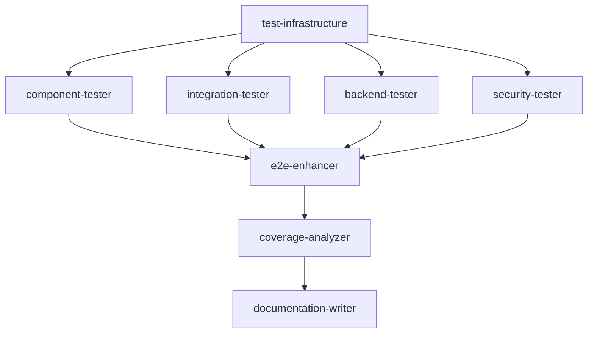

# Hierarchical Swarm Coordination Protocol
## Crypto-Campaign-Unified Testing Mission

### MISSION OVERVIEW
**Objective**: Achieve comprehensive test coverage (>90% line coverage, 100% API coverage) for crypto-campaign-unified project within 5 hours using hierarchical swarm coordination.

### SWARM HIERARCHY

```
👑 QUEEN COORDINATOR (This Session)
├── 🔧 INFRASTRUCTURE TIER (Priority: HIGH)
│   └── test-infrastructure (Agent ID: agent-1756116645833)
├── 🧪 CORE TESTING TIER (Priority: HIGH) 
│   ├── component-tester (Agent ID: agent-1756116648141)
│   ├── integration-tester (Agent ID: agent-1756116651016)
│   └── backend-tester (Agent ID: agent-1756116667482)
├── 🔒 SECURITY TIER (Priority: MEDIUM)
│   └── security-tester (Agent ID: agent-1756116664768)
├── 🎯 ENHANCEMENT TIER (Priority: MEDIUM)
│   └── e2e-enhancer (Agent ID: agent-1756116670477)
└── 📊 SUPPORT TIER (Priority: LOW)
    ├── coverage-analyzer (Agent ID: agent-1756116673152)
    └── documentation-writer (Agent ID: agent-1756116675946)
```

### COORDINATION PHASES

#### PHASE 1: INFRASTRUCTURE FOUNDATION (0-35 minutes)
**LEAD AGENT**: test-infrastructure
**STATUS**: 🔄 IN PROGRESS
**DEPENDENCIES**: None
**DELIVERABLES**:
- Vitest configuration optimization
- MSW mock service setup
- Test utilities and helpers
- Coverage reporting configuration
- Test database setup
- Environment configuration

#### PHASE 2: PARALLEL CORE TESTING (35-75 minutes)
**TRIGGERED BY**: Infrastructure completion signal
**PARALLEL AGENTS**:
- component-tester (Frontend components - 24 components, 2,409 lines)
- integration-tester (API, Web3, Database integration)
- backend-tester (Node.js API endpoints)
- security-tester (Security, validation, XSS prevention)

#### PHASE 3: ENHANCEMENT & VALIDATION (75-110 minutes)
**TRIGGERED BY**: Core testing 80% completion
**PARALLEL AGENTS**:
- e2e-enhancer (Playwright test enhancement)
- coverage-analyzer (Coverage reporting, CI/CD setup)

#### PHASE 4: DOCUMENTATION & FINALIZATION (110-125 minutes)
**TRIGGERED BY**: All testing completion
**FINAL AGENT**:
- documentation-writer (Test documentation, maintenance procedures)

### COMMUNICATION PROTOCOLS

#### Progress Reporting
- **Frequency**: Every 10 minutes
- **Method**: `npx claude-flow@alpha hooks notify --message "[AGENT] [STATUS] [PROGRESS]"`
- **Escalation**: Immediate notification for blockers

#### Memory Coordination
- **Infrastructure Config**: `swarm/infrastructure/config`
- **Component Coverage**: `swarm/components/coverage`
- **Integration Results**: `swarm/integration/results`
- **Security Findings**: `swarm/security/vulnerabilities`
- **E2E Enhancement**: `swarm/e2e/improvements`
- **Coverage Metrics**: `swarm/coverage/metrics`

#### Dependency Management


### SUCCESS METRICS

#### PRIMARY TARGETS
- ✅ >90% line coverage on frontend components
- ✅ 100% API endpoint test coverage
- ✅ Complete E2E test suite for critical user journeys
- ✅ Security test suite for all input validation
- ✅ CI/CD pipeline with automated testing

#### QUALITY GATES
- All tests pass consistently
- No critical security vulnerabilities
- Performance benchmarks established
- Documentation complete and accessible

### EMERGENCY PROTOCOLS

#### Escalation Triggers
- Agent timeout (>45 minutes without progress)
- Critical security vulnerability discovered
- Infrastructure failures blocking other agents
- Coverage targets not achievable within timeline

#### Response Actions
- Queen coordinator reassigns tasks
- Emergency agent spawn if needed
- Scope adjustment for timeline compliance
- Immediate stakeholder notification

### PROJECT PATHS
- **Root**: `/Users/Danallovertheplace/crypto-campaign-unified`
- **Frontend**: `/Users/Danallovertheplace/crypto-campaign-unified/frontend`
- **Backend**: `/Users/Danallovertheplace/crypto-campaign-unified/backend`
- **Tests**: `/Users/Danallovertheplace/crypto-campaign-unified/tests`
- **Contracts**: `/Users/Danallovertheplace/crypto-campaign-unified/contracts`

---
**INITIATED**: 2025-08-25T10:12:00Z
**QUEEN COORDINATOR**: Active monitoring and task orchestration
**STATUS**: 🔄 Infrastructure phase in progress